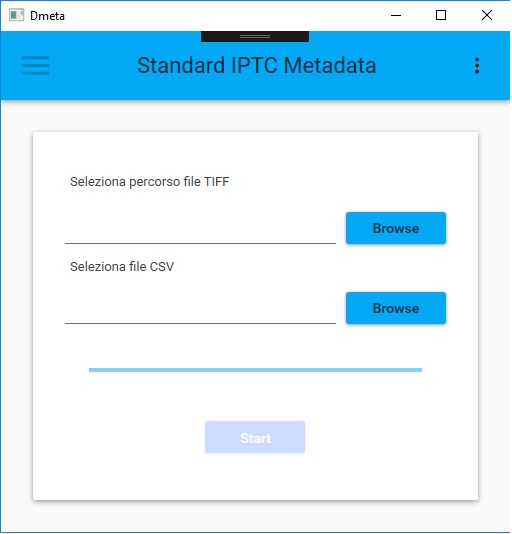

# Dmeta
Aggiunge i metadati secondo lo standard IPTC alle immagini TIFF utilizzando exiftool.

## Requisiti

* Scaricare [exiftool] (https://www.sno.phy.queensu.ca) e copiarlo nella directory di output
* Creare il file **meta.jsonéé basato sulla classe **Models.Metadata**

## Funzionamento
Passando in input un file csv\* e una directory contentente immagini TIFF il
programma genererà un file metadata.json che successivamente sarà passato come
parametro a exiftool per inserire i metadati.

\* *dovrete modificare la classe di riferimento in base alle vostre esigenze*

## Screenshot

